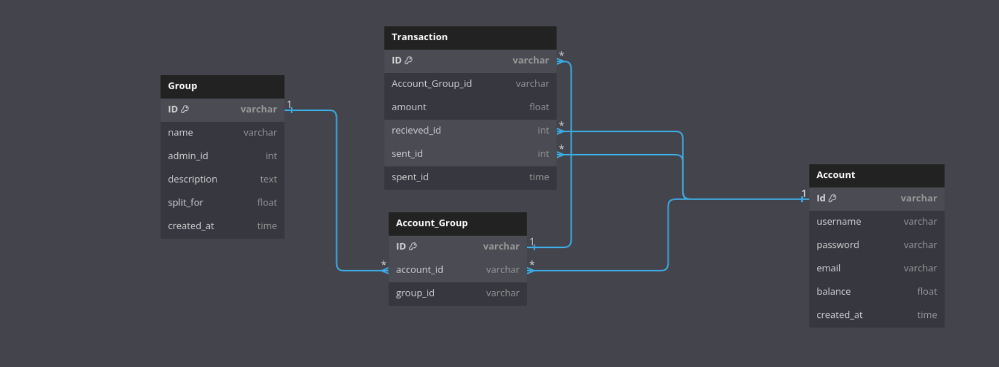

# Splitwise
Application for managing splits with friends or family when we want to split the amount which we spend

#### Run the Application

- Create a database Locally
- change/add the database name to the .env file
- run the script in database/Splitwise.sql to create tables 
- run database/migration.sql to populate some test data to database

Then RUN 
```bash
  go run main.go 
```

```http
GET /api/account/balance
```
Endpoints with Authentication token and gives current balance of the account 

```http
GET /api/account/spent
```

Gives the totals spends by the Account 
```http
POST /api/account/
```

endpoint that creates account 

```bash
      {
        "username":"",
        "password":"",
        "confirmPassword":"",
        "email":""
      }
```

```http
POST /api/groups/add
```
endpoint to ADD User to the group
example data 
```bash
    {
      "account_id":[3,5],
      "group_id":6
    }
```
```http
```


